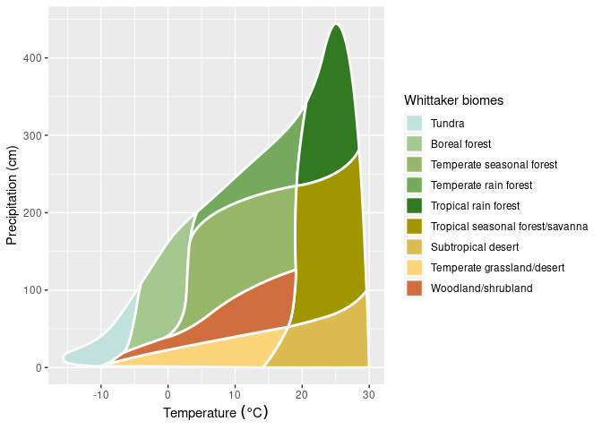

Práctica II – Eco-Inferencia: Modelando la relación clima-vegetación con
R
================
Arlen Marmolejo Hernández

### **Práctica II – Eco-Inferencia: Modelando la relación clima-vegetación con R**

<!-- -->

## **Unidad II – Ecosistemas y sus componentes**

- Factores abióticos
- Factores bióticos
- Relación entre factores abióticos y bióticos
- Biomas: características y distribución
- Ecosistemas: tipos, características y amenazas

**Objetivos:**

**Aplicar los conceptos de factores abióticos y bióticos, y dar nuestros
primeros pasos en R para analizar datos ecológicos.**

1.  **Relacionar** factores abióticos (clima) con la distribución de
    biomas, utilizando datos simulados como evidencia.
2.  **Analizar** un set de datos simple utilizando R (funciones base de
    graficación y resumen) para identificar patrones ecológicos.
3.  **Argumentar** y defender, en una discusión grupal, la clasificación
    de un ecosistema en un bioma específico, basándose en la
    interpretación de sus propios gráficos y la literatura
    proporcionada.
4.  **Sintetizar** información de diferentes fuentes (datos analizados y
    literatura) para construir una explicación coherente sobre las
    relaciones entre factores bióticos y abióticos.

Su misión, si deciden aceptarla, es descubrir la identidad de un bioma
misterioso. Reciben un set de datos (`localidad_X.csv`) con mediciones
de varios años de una localidad secreta. Su laboratorio portátil (R) les
ayudará a analizar la evidencia.

Hoy no recibirán la respuesta, sino que la construirán. El objetivo es
ser “ecólogos detectives” que usan datos y teoría para descubrir qué
bioma se esconde tras cada set de datos.

**Consignas:**

1.  **Activen su laboratorio:** Abran RStudio. Carguen el script
    `analisis_biomas.R` y ejecútenlo paso a paso para cargar y explorar
    sus datos.

No se espera que programen, sino que *ejecuten* y *observen*. “La
computadora es su herramienta para ver el patrón. Su cerebro es para
interpretarlo.”

2.  **Interroguen a la evidencia:**

- ¿Qué nos dice el gráfico? Marquen en el diagrama de Whittaker de sus
  apuntes dónde caería esta localidad.
- Usen `summary()`: ¿Cuál es el rango de temperaturas? ¿Y el de
  precipitación? ¿Son muy variables?
- Observen la columna `Especie_Dominante`. ¿Qué tipo de plantas son?
  ¿Qué adaptaciones podrían tener?

3.  **Construyan su teoría (Argumento de 3 evidencias):** Basándose en
    el análisis de datos y la literatura, ¿a qué bioma pertenece su
    localidad? Escriban su conclusión y preparen 3 evidencias sólidas
    que la respalden. Piensen como científicos: su evidencia debe
    conectar el factor abiótico (clima) con el biótico (vegetación).

- **Evidencia 1 (Basada en temperatura y precipitación):** “La
  temperatura media anual de X°C y la precipitación de Y mm se asemejan
  al rango del bioma Z según Whittaker…”
- **Evidencia 2 (Basada en la variabilidad/estacionalidad):** “La
  alta/baja variabilidad en los datos sugiere…”
- **Evidencia 3 (Basada en la especie dominante):** “La presencia de
  \[Especie\] es típica de biomas con \[característica\], lo que
  refuerza nuestra hipótesis…”

4.  **Preparen su informe oral:** Deberán convencer a la comunidad
    científica (el resto de la clase) de su hallazgo. Muestren su
    gráfico y expliquen su argumento.

------------------------------------------------------------------------

### **Rúbrica**

| Criterio                          | Lo hace con solidez (2 pts)                                                                                                          | Lo hace parcialmente (1 pt)                                                                     | No lo hace (0 pts)                                                      |
|:----------------------------------|:-------------------------------------------------------------------------------------------------------------------------------------|:------------------------------------------------------------------------------------------------|:------------------------------------------------------------------------|
| **Uso de R como herramienta**     | Ejecuta el script sin dificultad y utiliza los outputs (gráfico, summary) para guiar su análisis.                                    | Ejecuta el script pero necesita ayuda para interpretar los outputs.                             | Se enfoca en el código y no logra usar los resultados para el análisis. |
| **Análisis e Interpretación**     | Conecta correctamente los patrones de los datos (temperatura, precipitación) con las características de los biomas de la literatura. | Reconoce los patrones en los datos pero tiene dificultades para asociarlos a un bioma concreto. | Describe los datos sin conectarlos a los conceptos ecológicos.          |
| **Construcción del Argumento**    | El argumento integra al menos dos líneas de evidencia (datos y literatura) de forma coherente y lógica.                              | El argumento se basa en una sola línea de evidencia o es débil.                                 | No presenta un argumento claro, solo una afirmación.                    |
| **Participación en la Discusión** | El grupo presenta con claridad y participa activamente en la discusión plenaria, escuchando a los demás.                             | El grupo presenta pero no interactúa en la discusión.                                           | El grupo no logra comunicar sus ideas.                                  |

—
